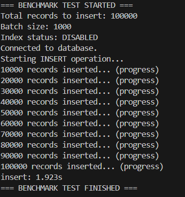
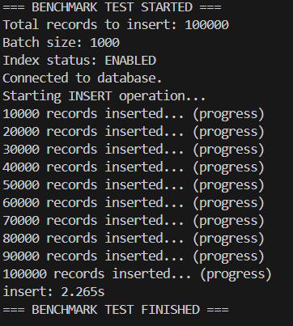
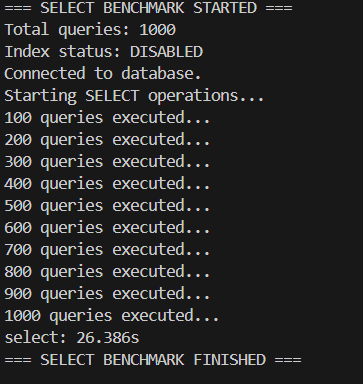
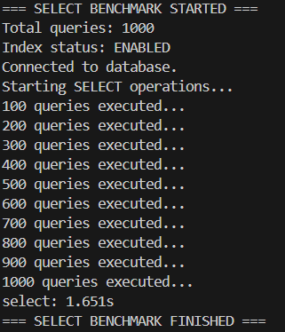

# 🧪 Database Performance Lab

This project is built to **learn, test, and document PostgreSQL database performance** under real-world conditions.

---

## ✅ Goal

Understand how indexing, batch size, data volume, and query type affect performance—useful for system design, scaling, and interview preparation.

---

## 🔎 Insert Benchmark: Insert Performance: Index vs No Index

No Index:

Index:

---

## 📈 Results & Insights
During the tests, the same dataset was inserted into PostgreSQL with and without an index on the user_id column.

Without index: The operation completed faster since PostgreSQL only had to write data directly into the table.

With index: The operation took slightly longer because PostgreSQL had to maintain and update the index structure for each inserted row.

## 🧪 Insert Benchmark Metrics
| Index Status | Total Records | Insert Duration | Difference        |
| ------------ | ------------- | --------------- | ----------------- |
| Disabled     | 100,000       | 1.923 seconds   | —                 |
| Enabled      | 100,000       | 2.265 seconds   | ⬆️ \~17.8% slower |

💡 Observation: Enabling an index on a high-volume insert workload increased total insert time by approximately 18%.

---

🧠 General Takeaways

➡️ If a table receives frequent inserts (e.g., event logs, transaction records), having too many indexes can negatively impact write performance due to the overhead of maintaining those indexes.

➡️ For write-heavy tables, index usage should be carefully planned. Consider deferring index creation until after bulk inserts are complete, or only keeping the most essential indexes.

⚠️ Keep in mind: Indexes greatly improve read/query performance. It’s always a trade-off between write speed and query efficiency, and the choice depends on your specific use case.

---

## 🔎 SELECT Benchmark: Index vs No Index

We executed 1000 SELECT queries filtering by `user_id` and `amount`, ordered by `created_at DESC`.

No Index:

Index:

---

## 📈 Result & Interpretation

In this benchmark:

- **No Index:** PostgreSQL performed full table scans.  
- **Index:** PostgreSQL utilized a composite index `(user_id, amount, created_at)` and drastically improved performance.

🧠 Queries were approximately **93.7% faster** with the index in place.

➡️ This shows that indexes are crucial for read-heavy operations involving filters and ordering.

---

## 🧪 Select Benchmark Metrics
| Index Status | Query Count | Total Duration | Performance Improvement    |
| ------------ | ----------- | -------------- | -------------------------- |
| Disabled     | 1,000       | 26.386 s       | Baseline (Full table scan) |
| Enabled      | 1,000       | 1.651 s        | \~93.7% faster with index  |

